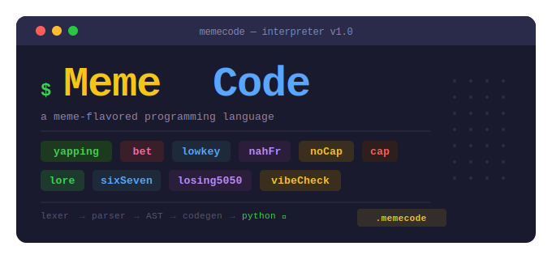

# MemeCode

<p align="center">
  
</p>

## Language overview

**MemeCode** is a small educational programming language with meme-themed keywords. A source file (`.memecode`) is compiled to Python and executed by the host interpreter. The implementation follows a classic pipeline: **lexer → parser → abstract syntax tree (AST) → code generator**, matching the structure typically used when teaching compilers and formal grammars.

The language includes typed variable declarations, `yapping` for output, conditionals (`bet` / `lowkey` / `nahFr`), comparisons, and boolean logic (`&&`, `||`, `!`, or the keywords `and`, `or`, `not`). Line comments begin with `#`. There are no user-defined functions in the current version; control flow and expressions are otherwise similar in spirit to a restricted subset of Python.

**How to run:** from the project directory,

```bash
python interpreter.py yourfile.memecode
```

---

## Example program

Below is a valid `.memecode` sample (at least seven lines of code) showing **comments**, **variables**, **types**, **printing**, **conditionals**, and **boolean / comparison** expressions:

```text
# Demo: variables, logic, and branching
lore msg = "MemeCode says hi"
sixSeven n = 3
vibeCheck ok = n > 1 && n < 10
losing5050 pi = 3.14

yapping(msg)
yapping(ok)
yapping(pi)

bet ok == noCap {
    yapping("logic checks out")
} lowkey n == 0 {
    yapping("zero")
} nahFr {
    yapping("other case")
}
```

---

## Full syntax table

MemeCode keyword or symbol (left) and its role (right).

| Syntax | Meaning |
|--------|---------|
| `yapping(expr1, expr2, ...)` | Print one or more expressions (like `print` in Python). |
| `lore` | String type; initializer must be a string literal. |
| `sixSeven` | Integer type; initializer must be an integer literal. |
| `losing5050` | Float type; initializer must be a float literal. |
| `vibeCheck` | Boolean type; initializer is a boolean expression. |
| `noCap` | Boolean literal **true**. |
| `cap` | Boolean literal **false**. |
| `=` | Assignment in declarations: `type name = expr`. |
| `bet` | Start conditional (`if`). |
| `lowkey` | Else-if branch (`elif`). |
| `nahFr` | Else branch (`else`). |
| `{` `}` | Block delimiters around statement lists. |
| `==` `!=` `<` `>` `<=` `>=` | Comparisons (chain allowed, e.g. `a < b < c`). |
| `&&` `||` | Logical **and** / **or** (also `and` / `or`). |
| `!` | Logical **not** (also keyword `not`). |
| `#` … end of line | Line comment (ignored by the lexer). |

---

## Grammar (EBNF)

The following **extended BNF** describes MemeCode’s concrete syntax. Notation: `|` alternation, `[ … ]` zero or one, `{ … }` zero or more, `"…"` terminals, *italic* nonterminals. This matches common textbook-style EBNF (e.g. repetition and optionality written with `{ }` and `[ ]`).

```ebnf
(* 1. Program: optional newlines, statements, end of file *)
program     ::= { newline } { statement newline } EOF ;

(* 2–4. Top-level statements *)
statement   ::= print_stmt | decl_stmt | if_stmt ;

(* 5. Print *)
print_stmt  ::= "yapping" "(" expr { "," expr } ")" ;

(* 6–7. Typed declaration *)
decl_stmt   ::= type identifier "=" expr ;
type        ::= "lore" | "sixSeven" | "vibeCheck" | "losing5050" ;

(* 8–11. Conditional with optional else-if and else *)
if_stmt     ::= "bet" expr block { elseif_part } [ else_part ] ;
elseif_part ::= "lowkey" expr block ;
else_part   ::= "nahFr" block ;

(* 12. Block: brace-enclosed list of statements *)
block       ::= "{" { newline statement } newline "}" ;

(* 13–18. Expressions: precedence or < and < not < comparison < primary *)
expr        ::= or_expr ;
or_expr     ::= and_expr { or_op and_expr } ;
or_op       ::= "||" | "or" ;
and_expr    ::= not_expr { and_op not_expr } ;
and_op      ::= "&&" | "and" ;
not_expr    ::= [ "not" | "!" ] not_expr | comparison ;

(* 19–20. Comparisons; may chain like Python *)
comparison  ::= primary { cmp_op primary } ;
cmp_op      ::= "==" | "!=" | "<" | ">" | "<=" | ">=" ;

(* 21–22. Primary: literals, identifiers, parenthesized expr *)
primary     ::= literal | identifier | "(" expr ")" ;
literal     ::= string | integer | float | bool_lit ;
bool_lit    ::= "noCap" | "cap" ;
```

*Lexical notes (not repeated as separate productions above):* `identifier` is a letter or underscore followed by letters, digits, or underscores; `string` is characters between `"` … `"`; `integer` and `float` follow the lexer’s numeric rules; whitespace separates tokens; `#` starts a comment to end of line.

---

## Group members


| # | Full name |
|---|-----------|
| 1 | Duong Thanh Toan |

